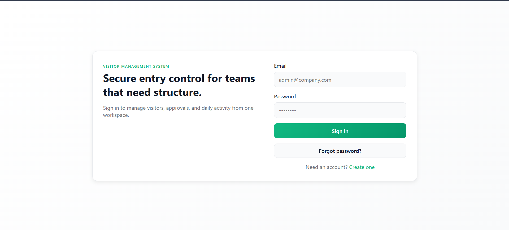
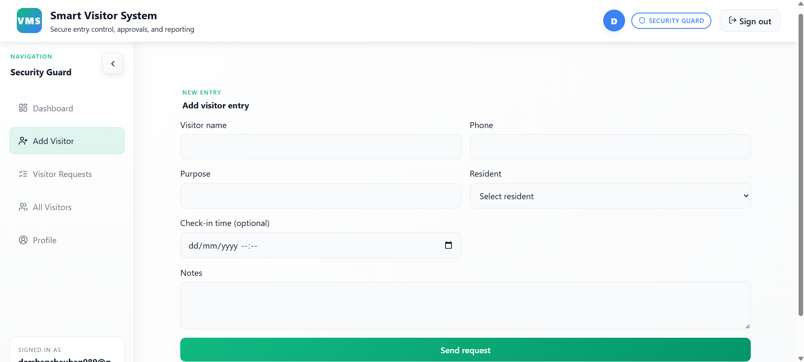
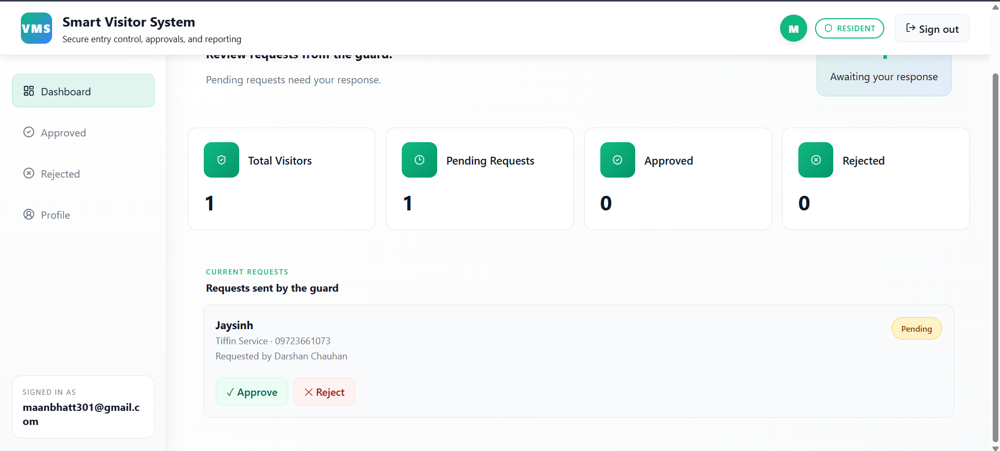
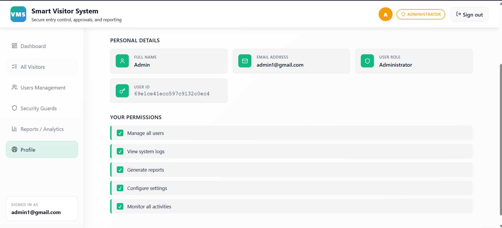
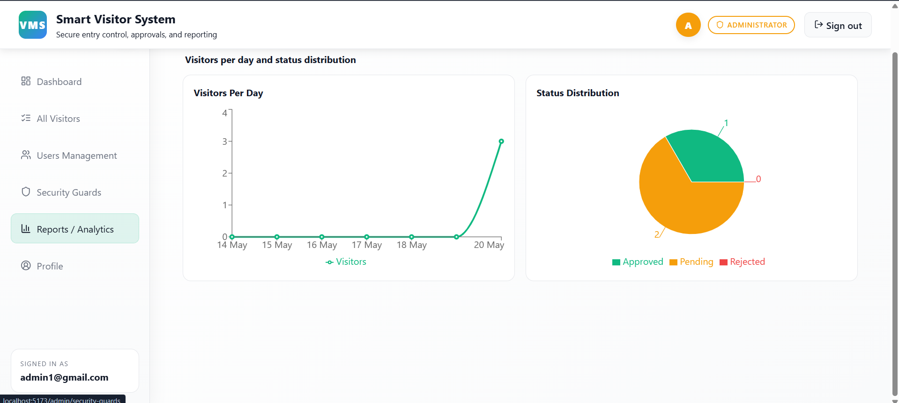

# Visitor Management System

>A small full-stack Visitor Management System (Express + MongoDB backend, React + Vite frontend).

## Quick start

Prerequisites:
- Node.js (16+ recommended)
- npm or yarn
- MongoDB running locally or a connection string

1. Clone / open the workspace.

### Backend

1. Install dependencies and start dev server:

```bash
cd backend
npm install
npm run dev
```

The backend defaults to port `3000`. The health endpoint is `/api/health`.

### Frontend

1. Install dependencies and start dev server:

```bash
cd frontend
npm install
npm run dev
```

The frontend uses Vite and proxies `/api` to the backend. See `vite.config.js` for the proxy target.

## Environment variables (backend)

Create a `.env` file in `backend/` (an example of useful keys):

```
MONGODB_URL=mongodb://127.0.0.1:27017/visitor_management
PORT=3000
SECRET=your_jwt_secret
JWT_SECRET=your_jwt_secret
CLIENT_ORIGIN=http://localhost:5173

# Email (Resend preferred on Render)
RESEND_API_KEY=re_xxxxxxxxxxxxxxxxxxxxxx
RESEND_FROM="Visitor Management System <onboarding@resend.dev>"

# Optional SMTP fallback (used only if RESEND_API_KEY is missing or Resend fails)
SMTP_USER=you@example.com
SMTP_PASS=your-app-password
SMTP_HOST=smtp.gmail.com
SMTP_PORT=587
SMTP_SECURE=false
EMAIL_FROM_NAME="Visitor Management System"

ADMIN_CODE=invite-admin
SECURITY_CODE=invite-security
```

Notes:
- The backend uses Resend first when `RESEND_API_KEY` is set.
- If Resend is not configured (or fails), SMTP fallback is used when SMTP vars are available.
- Recommended Render vars for email: `RESEND_API_KEY` and `RESEND_FROM`.
- For Resend sandbox testing, `onboarding@resend.dev` works with your account email. For production, use a verified sender domain in Resend.

## OTP / Password reset flow

- Frontend calls `POST /api/auth/forgot-password` with `{ email }` to generate/send an OTP.
- The backend will respond with `{ message: 'If the email exists, an OTP has been sent.' }` in normal cases.
- In development (no SMTP) the backend returns `devOtp` when available. The UI displays that message.

## Troubleshooting

- If the UI shows "Something went wrong":
   - Open browser devtools → Network and inspect the request to `/api/auth/forgot-password`.
   - Confirm the dev server proxy target matches the backend port (see `frontend/vite.config.js`).
   - Ensure backend is running (`npm run dev` in `backend`).

- Common ports: Vite (5173 default), backend (3000). If you change backend port, update `vite.config.js` proxy accordingly.

## Useful commands

From project root:

```bash
# Start backend
cd backend && npm run dev

# Start frontend (in another terminal)
cd frontend && npm run dev
```

## Contributing

Open an issue or submit a PR. Keep changes focused and run the app locally to validate.

---
Generated README to help run and debug the project locally.

## Screenshots

Overview screenshots showing the main flows and UI components. These are illustrative screenshots included in the repository.

### Login Screen


### Guard Dashboard


### User Dashboard


### Admin Panel


### Report Page


# Visitor Management System

Full-stack MERN visitor management system with separate frontend and backend folders, three role types, and a role-aware dashboard flow.

## Roles

- `security` - creates visitor requests at the gate, selects the resident, and handles check-in/check-out
- `user` - receives incoming requests and approves or rejects them
- `admin` - reviews all logs, filters by resident/status/date, and audits who approved or rejected each visit

## Core Flow

1. Security creates a visitor request with status `pending`.
2. The resident sees the request in-app and approves or rejects it.
3. If approved, security can check the visitor in.
4. Security checks the visitor out on exit.
5. Admin can review the full audit trail, including response time and approval source.

## Project Structure

- `frontend` - React + Vite app
- `backend` - Express + MongoDB API

## API Summary

- `POST /api/visitor/create`
- `PUT /api/visitor/respond/:id`
- `PUT /api/visitor/checkin/:id`
- `PUT /api/visitor/checkout/:id`
- `GET /api/visitor/pending`
- `GET /api/visitor/admin/logs`

## Setup

1. Install dependencies from the project root:

   ```bash
   npm install
   ```

2. Configure environment variables:

   - `backend/.env` based on `backend/.env.example`

3. Start both apps:

   ```bash
   npm run dev
   ```

## Default Ports

- Frontend: `http://localhost:5173`
- Backend: `http://localhost:5000`
